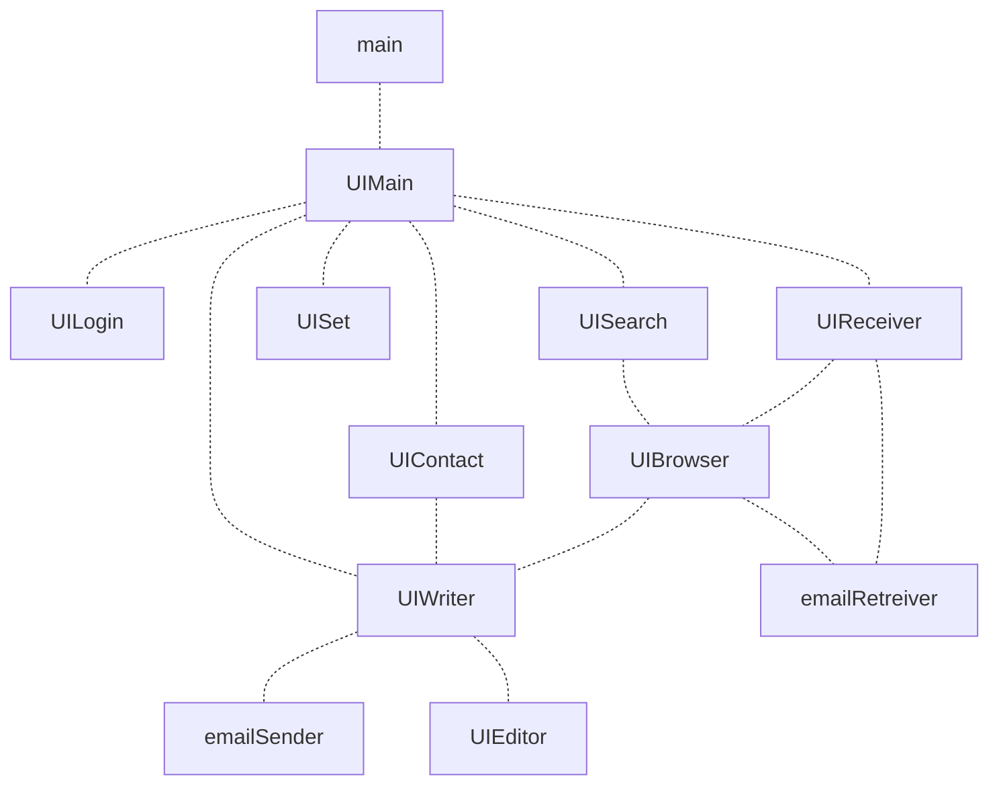
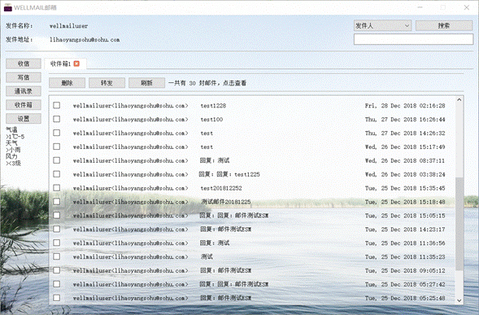

## “WELLMAIL" 电子邮件客户端

#### 作者

李皓阳，刘鑫，王韵

#### 描述

本程序为2018年华中科技大学电信学院软件课程设计，为一个简单的电子邮件客户端程序，由Python实现，带有PyQt5实现的图形用户界面。

#### 编写环境

Windows 10, Python 3.7 64-bit

附带PyQt5，因此只需要Python标准库即可运行。

#### 运行方式

```
python main.py
```

#### 程序结构



#### 运行效果




